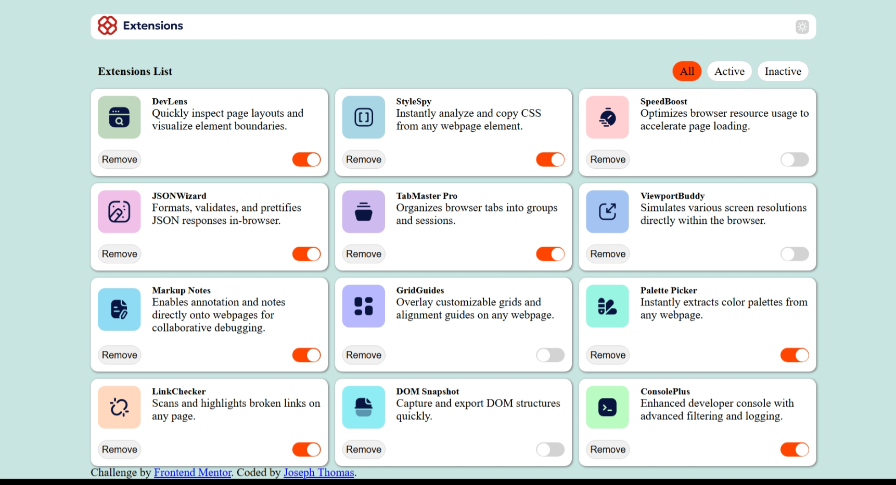
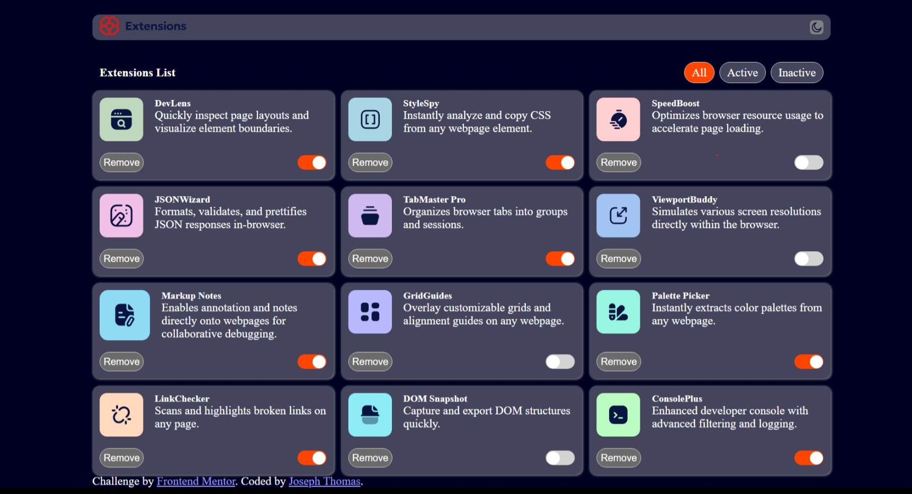

# Frontend Mentor - Browser extensions manager UI solution

This is a solution to the [Browser extensions manager UI challenge on Frontend Mentor](https://www.frontendmentor.io/challenges/browser-extension-manager-ui-yNZnOfsMAp). Frontend Mentor challenges help you improve your coding skills by building realistic projects. 

## Table of contents

- [Overview](#overview)
  - [The challenge](#the-challenge)
  - [Screenshot](#screenshot)
  - [Links](#links)
- [My process](#my-process)
  - [Built with](#built-with)
  - [What I learned](#what-i-learned)
  - [Continued development](#continued-development)
  - [Useful resources](#useful-resources)
- [Author](#author)
- [Acknowledgments](#acknowledgments)

**Note: Delete this note and update the table of contents based on what sections you keep.**

## Overview

### The challenge

Users should be able to:

- Toggle extensions between active and inactive states
- Filter active and inactive extensions
- Remove extensions from the list
- Select their color theme
- View the optimal layout for the interface depending on their device's screen size
- See hover and focus states for all interactive elements on the page

### Screenshot

_Light Mode_

_Dark Mode_

### Links

- Solution URL: [Github Link](https://github.com/jojothomas1515/frontendmentor-browser-extension)
- Live Site URL: [Live link on vercel](https://frontendmentor-browser-extension.vercel.app/)

## My process

### Built with

- HTML5
- CSS
- JAVASCRIPT

### What I learned

For this project i choose to use the basic html css ans js, and not include any framework. Doing that has helped appreciate how modern day frameworks and library helped made our life easier.For example when i was trying to remove extentions and filter extension base on it state, if it is active or not, it would have be five times easier and faster to do it with react.

It was a fine experience so far.

## Author

<!-- - Website - [Add your name here](https://www.your-site.com) -->
- Frontend Mentor - [@jojothomas1515](https://www.frontendmentor.io/profile/jojothomas1515)
- Twitter - [@jojothomas1515](https://www.x.com/jojothomas1515)
